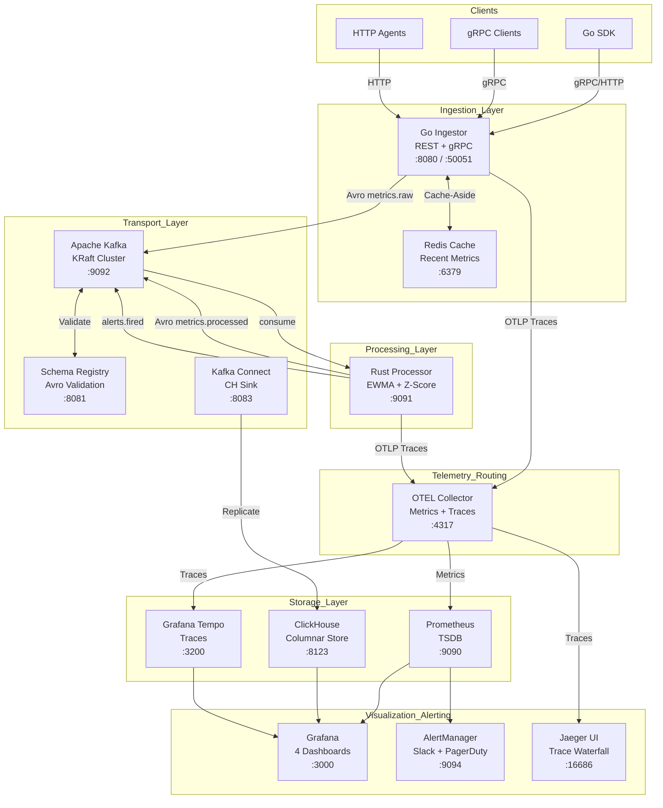

# Enterprise Observability Pipeline

A distributed, production-grade observability pipeline built with **Go**, **Rust**, **Apache Kafka**, **Prometheus**, **Grafana**, **ClickHouse**, **Redis**, and **OpenTelemetry**. The same class of infrastructure that powers Datadog, New Relic, and Grafana Cloud — built from scratch for massive scale.

---

## Architecture



---

## 10 Enterprise Integrations

| Feature | Impact | Implementation |
|---|---|---|
| **Grafana Tempo** | Trace Storage | High-scale distributed trace backend correlating logs, metrics, and traces. |
| **Jaeger** | Trace UI | Open-source trace visualization for debugging request waterfalls across Go and Rust. |
| **Redis Caching** | Performance | Cache-aside pattern in Go ingestor for ultra-fast queries of recent metrics. |
| **Schema Registry** | Governance | Confluent Schema Registry ensuring Avro schema compatibility and preventing breaking changes. |
| **gRPC Endpoint** | Efficiency | High-performance binary protocol (`proto3`) for high-throughput SDK clients. |
| **Helm Chart** | Orchestration | Production-ready Helm chart with HPAs, PDBs, and 12-component deployment logic. |
| **Terraform** | IaC | AWS EKS infrastructure (VPC, 3 node groups, ElastiCache Redis, MSK/ClickHouse ready). |
| **OTEL Collector** | Telemetry | OpenTelemetry Collector routing OTLP traces to Tempo/Jaeger and metrics to Prometheus. |
| **Kafka Connect** | Replication | ClickHouse Sink connector for exactly-once replication from Kafka topics to storage. |
| **AlertManager Pro** | Reliability | Production routing tree: Critical → PagerDuty, Warnings → Slack, SLOs → #obs-slo. |

---

## Quick Start (Local Development)

```bash
# 1. Start all 12 containers
make dev

# 2. Fire 1000 metrics/sec for 60s (tests the full pipeline)
make fire

# 3. View Dashboards
# Grafana:    http://localhost:3000  (admin/admin)
# Prometheus: http://localhost:9090
# Jaeger:     http://localhost:16686
# Ingestor:   http://localhost:8080/health
```

---

## 📊 Dashboards Included

1. **Pipeline Overview** — Throughput, latency (p50/p95/p99), consumer lag, and system health.
2. **SLO & Error Budget** — Availability gauges, error budget burn rates, and SLO target monitoring.
3. **Historical Trends** — 90-day data queries backed by ClickHouse columnar storage.
4. **Distributed Tracing** — Trace ingestion rates, OTEL collector health, and trace search.

---

## 🚀 Deployment (Production)

### 1. Provision Infrastructure (AWS)
```bash
cd terraform
terraform init
terraform apply -var="environment=production"
```

### 2. Deploy to Kubernetes
```bash
# Update kubeconfig
aws eks update-kubeconfig --name obs-pipeline-cluster --region us-east-1

# Install via Helm
helm install obs-pipeline ./helm/observability-pipeline/ -n observability --create-namespace
```

---

## 🛠️ Tech Stack

- **Go 1.22+**: Ingestor, SDK, gRPC server.
- **Rust 1.77+**: High-throughput stream processor.
- **Kafka 7.6.0**: Message broker with KRaft mode.
- **ClickHouse 24.3 LTS**: Columnar storage for petabyte-scale analytics.
- **Prometheus 2.51**: Real-time TSDB and alerting.
- **Redis 7.2**: Low-latency caching layer.
- **OpenTelemetry**: Distributed tracing and telemetry routing.
- **Terraform / Helm**: Infrastructure and orchestration as code.

---

## Project Structure

```
observability-pipeline/
├── ingestor/         # Go HTTP/gRPC + Kafka producer + Redis cache
├── processor/        # Rust Kafka consumer + Anomaly detector (EWMA/Z-Score)
├── sdk/go/           # Go SDK with batching and auto-instrumentation
├── infra/            # Configs for Kafka, ClickHouse, Prometheus, Tempo, OTEL
├── helm/             # Kubernetes Helm charts (12 components)
├── terraform/        # AWS EKS Infrastructure (VPC, Node Groups, Redis)
├── proto/            # Protobuf definitions for gRPC ingestion
├── tests/            # Integration (25 tests) and load testing (k6)
└── Makefile          # Unified command interface
```

---

## 🏗️ Design Decisions

**Why Kafka over Redis Streams?**
Kafka is a distributed commit log — consumers can re-read, replay, and fan-out independently. If the Rust processor crashes, metrics persist in Kafka until recovery. Redis Streams lose data without persistence config and don't support true consumer groups with partition-level parallelism.

**Why Rust for the processor?**
The borrow checker guarantees zero data races in concurrent message processing. tokio async gives efficient I/O without OS thread overhead. Zero-cost abstractions mean processing latency measured in microseconds, not milliseconds.

**Why ClickHouse for long-term storage?**
Prometheus is designed for 15-day retention, not multi-year queries. ClickHouse's columnar MergeTree achieves 15-40x compression on time-series data. A query over 1 year completes in milliseconds vs minutes in PostgreSQL.

**Why manual Kafka offset commits?**
`enable.auto.commit=false` with commit-after-ClickHouse-write ensures at-least-once delivery. Combined with ReplacingMergeTree deduplication, this achieves exactly-once semantics without transactions.

**Why a circuit breaker on ClickHouse?**
Under degraded network or ClickHouse overload, retrying writes indefinitely causes cascading failures. The circuit breaker (Closed → Open → Half-Open) with exponential backoff protects the processor from stalling the entire pipeline.

**Why per-tenant rate limiting?**
Multi-tenancy requires isolation. A noisy tenant sending 100k metrics/sec shouldn't starve others. Independent token buckets per tenant, keyed by `X-Tenant-ID`, enforce fair resource allocation without global coordination.

---

## Makefile Targets

```
make dev              # Start full 12-container stack
make down             # Stop all services
make test             # Go test + Cargo test
make lint             # Go vet + Cargo clippy
make fire             # Fire 1000 metrics/sec for 60s
make load-test        # k6 load test (100k/sec target)
make logs             # Follow container logs
make status           # Service health + Kafka topics
make integration-test # Run 25 end-to-end tests
make sdk-test         # Run Go SDK tests
make helm-template    # Render Helm chart (dry-run)
make helm-install     # Deploy to Kubernetes via Helm
make schema-register  # Register Avro schemas
make connect-deploy   # Deploy Kafka Connect sink
make grpc-gen         # Generate gRPC stubs from proto
make terraform-plan   # Plan AWS EKS infrastructure
make terraform-apply  # Provision AWS EKS
make clean            # Stop + remove all volumes
```

---

## ⚠️ Known Limitations & What I'd Do Differently

- **Single Kafka broker in dev**: Production uses 3-broker StatefulSet with RF=2 (see `k8s/kafka/` and `helm/`)
- **No TLS/mTLS**: All dev connections are plaintext. Production should use TLS on Kafka, ClickHouse, and gRPC
- **gRPC uses JSON framing**: The TCP server uses JSON-over-TCP as a protoc-free fallback. Run `make grpc-gen` with protoc installed for full binary gRPC
- **Schema Registry validation is config-only**: Avro schemas are registered but producers don't enforce runtime validation yet — add `srclient` in Go and `schema_registry_converter` in Rust
- **Redis cache is opt-in**: The cache layer is built but not wired into the HTTP handler by default. Connect it via dependency injection in `main.go`
- **Terraform state backend**: The S3 backend requires creating the bucket and DynamoDB table before first `terraform init`

---

## License

MIT — Kevin Bastin


