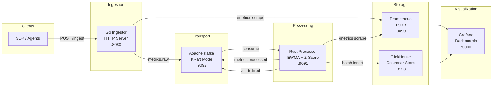

# Enterprise Observability Pipeline

A distributed, production-grade observability pipeline built with **Go**, **Rust**, **Apache Kafka**, **Prometheus**, **Grafana**, and **ClickHouse**. The same class of infrastructure that powers Datadog, New Relic, and Grafana Cloud — built from scratch.

```
Ingestor (Go)  →  Kafka (KRaft)  →  Processor (Rust)  →  ClickHouse + Prometheus  →  Grafana
```

---

## Architecture



## Components

| Component | Language | Role |
|-----------|----------|------|
| **Ingestor** | Go 1.22+ | HTTP server accepting metrics via REST. Validates, rate-limits, and publishes to Kafka using franz-go. |
| **Kafka** | — | KRaft-mode broker (no ZooKeeper). Topics: `metrics.raw`, `metrics.processed`, `alerts.fired`, `metrics.dlq`. |
| **Processor** | Rust | Kafka consumer with EWMA and rolling Z-score anomaly detection. Batch-writes to ClickHouse. |
| **Prometheus** | — | Scrapes `/metrics` from all services. 15-day hot data retention. AlertManager integration. |
| **ClickHouse** | SQL | Columnar long-term storage (1 year). MergeTree with monthly partitioning, hourly/daily materialized views. |
| **Grafana** | — | Provisioned dashboards: pipeline overview, SLO/error-budget, ClickHouse historical trends. |

## Quick Start

```bash
# Clone
git clone https://github.com/Kevinbastin/observability-pipeline.git
cd observability-pipeline

# Start everything
make dev

# Open dashboards
# Grafana:    http://localhost:3000  (admin/admin)
# Prometheus: http://localhost:9090
# Ingestor:   http://localhost:8080/health

# Fire test metrics (1000/sec for 60s)
make fire

# Check status
make status
```

## API

### `POST /ingest` — Single metric
```json
{
  "name": "api.request.duration_ms",
  "value": 142.7,
  "unit": "ms",
  "tags": {"service": "checkout", "endpoint": "/cart/add"},
  "timestamp": 1714900000,
  "host": "prod-api-07"
}
```

### `POST /ingest/batch` — Batch (up to 1000)
```json
{
  "metrics": [ ... ]
}
```

### `GET /health` · `GET /ready` · `GET /metrics`

## Anomaly Detection

The Rust processor applies two complementary algorithms:

**EWMA (Exponentially Weighted Moving Average)**
- Tracks smoothed mean and variance with configurable alpha (default: 0.3)
- Flags values exceeding N standard deviations (default: 3σ)
- Fast reaction to sudden changes

**Rolling Z-Score**
- Maintains a sliding window (default: 300 samples / 5 minutes)
- Computes statistical Z-score against window distribution
- Robust against gradual regime changes

Both detectors run per-metric per-host. An anomaly from either triggers an alert.

## Kafka Topics

| Topic | Partitions | Purpose |
|-------|------------|---------|
| `metrics.raw` | 6 | Validated metrics from ingestor |
| `metrics.processed` | 6 | Annotated metrics with anomaly scores |
| `alerts.fired` | 3 | Alert events for downstream consumers |
| `metrics.dlq` | 3 | Dead-letter queue (7-day retention) |

## ClickHouse Schema

- **`metrics`** — ReplacingMergeTree, monthly partitions, 1-year TTL, Gorilla + LZ4 compression
- **`metrics_hourly`** — AggregatingMergeTree materialized view (avg, min, max, p50, p95, p99)
- **`metrics_daily`** — AggregatingMergeTree daily rollup
- **`alerts`** — MergeTree audit log

## Alert Rules

| Alert | Condition | Severity |
|-------|-----------|----------|
| IngestorHighErrorRate | 5xx rate > 5% for 5m | Critical |
| KafkaConsumerLagHigh | Lag > 10,000 for 2m | Warning |
| ProcessorDown | Service unreachable for 1m | Critical |
| ClickHouseWriteLatencyHigh | p99 > 500ms for 5m | Warning |
| AnomalyRateSpike | Anomaly rate > 10% for 5m | Warning |
| SLOBurnRateFast | 14.4x burn rate (5m+1h windows) | Critical |
| SLOBurnRateSlow | 3x burn rate (6h window) | Warning |

## Design Decisions

**Why Kafka over Redis Streams?**
Kafka is a distributed commit log — consumers can re-read, replay, and fan-out independently. If the Rust processor crashes, metrics persist in Kafka until recovery. Redis Streams lose data without persistence config and don't support true consumer groups with partition-level parallelism.

**Why Rust for the processor?**
The borrow checker guarantees zero data races in concurrent message processing. tokio async gives efficient I/O without OS thread overhead. Zero-cost abstractions mean processing latency measured in microseconds, not milliseconds.

**Why ClickHouse for long-term storage?**
Prometheus is designed for 15-day retention, not multi-year queries. ClickHouse's columnar MergeTree achieves 15-40x compression on time-series data. A query over 1 year completes in milliseconds vs minutes in PostgreSQL.

**Why manual Kafka offset commits?**
`enable.auto.commit=false` with commit-after-ClickHouse-write ensures at-least-once delivery. Combined with ReplacingMergeTree deduplication, this achieves exactly-once semantics without transactions.

## Project Structure

```
observability-pipeline/
├── docker-compose.yml          # Full local stack
├── Makefile                    # dev, test, lint, load-test
├── ingestor/                   # Go HTTP + Kafka producer
│   ├── cmd/server/main.go
│   ├── internal/
│   │   ├── handler/            # HTTP handlers
│   │   ├── producer/           # franz-go Kafka producer
│   │   ├── validator/          # Schema validation
│   │   ├── middleware/         # Rate limit, logging, metrics
│   │   └── model/              # Data structures
│   ├── config/config.go
│   └── Dockerfile
├── processor/                  # Rust Kafka consumer + detector
│   ├── src/
│   │   ├── main.rs
│   │   ├── consumer.rs         # Kafka consumer loop
│   │   ├── detector/           # EWMA + Z-score algorithms
│   │   ├── storage/            # ClickHouse batch writer
│   │   ├── producer.rs         # Alert publisher
│   │   └── metrics.rs          # Prometheus instrumentation
│   ├── Cargo.toml
│   └── Dockerfile
├── infra/                      # Infrastructure configs
│   ├── kafka/topics.sh
│   ├── prometheus/             # Scrape + alert rules
│   ├── alertmanager/
│   ├── grafana/                # Provisioned dashboards
│   └── clickhouse/             # Schema + materialized views
├── k8s/                        # Kubernetes manifests
├── tests/load/                 # k6 + Go load tests
└── .github/workflows/ci.yml   # CI pipeline
```

## Makefile Targets

```
make dev       # Start full stack
make down      # Stop all services
make test      # Go test + Cargo test
make lint      # Go vet + Cargo clippy
make fire      # Fire 1000 metrics/sec
make load-test # k6 load test
make logs      # Follow container logs
make status    # Service status + Kafka topics
make clean     # Stop + remove volumes
```

## Tech Stack

| Tool | Version | Purpose |
|------|---------|---------|
| Go | 1.22+ | Ingestor HTTP server |
| Rust | 1.77+ | Stream processor |
| Apache Kafka | 7.6.0 (CP) | Message broker (KRaft) |
| Prometheus | 2.51.0 | Time-series DB + scraper |
| Grafana | 10.4.0 | Dashboards + alerting |
| ClickHouse | 24.3 LTS | Columnar long-term storage |
| Docker Compose | v2+ | Local orchestration |

## Known Limitations & Future Work

- **Single Kafka broker in dev**: Production deployment uses 3-broker StatefulSet (see `k8s/kafka/`)
- **No TLS/mTLS yet**: All connections are plaintext in dev; production should add TLS everywhere
- **No Schema Registry**: Consider Confluent Schema Registry for Avro schemas in production
- **No distributed tracing**: OpenTelemetry trace propagation planned for v2
- **Processor scaling**: Currently single-threaded consumer; add partition-aware multi-worker in v2

## License

MIT
